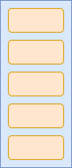
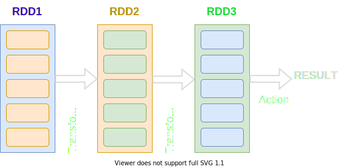
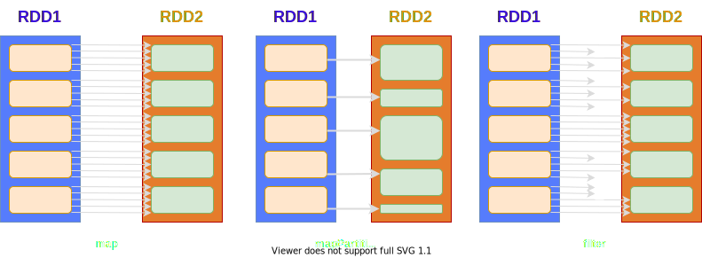
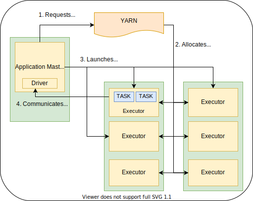

    val spark = SparkSession
               .builder()
               .appName("Spark Basics")
               .config("author.name", "kshitij-tyagi")
               .getOrCreate()

---

### What is SPARK?

:::incremental
* Large scale data processing system.
* Distributed ⇒ Distributed Data
:::

---

## RDD | PARTITIONS

:::incremental
* Resilient Distributed Dataset.
* RDD essentially is
  - an IMMUTABLE collection of elements of your data
  - DISTRIBUTED across nodes in your cluster
  - partitioned into PARTITIONS
* The partitions can be operated in parallel
* RDD was also the primary user-facing API in Spark since its inception.
* Uses a Row object as representation of an element.
:::

[//]: # (One slide showing the usage and example)
[//]: # (OR)
[//]: # (live working example on spark-shell)

---

## RDD | PARTITIONS

---

## DATASET 

:::incremental
* "Collection of strongly-typed JVM objects"
* Dataset api comes with declarative and type-safe operators
* Safety of syntax and analysis checks at compile time
:::

---

## DATASET | ENCODERS

:::incremental
* Encoders are responsible for converting between JVM objects and the InternalRow object.
* Spark provides Encoder implementations for most of the standard types (including case classes)
* ExpressionEncoder[T] : generic encoder for jvm objects of type T
:::

[//]: # (spark shell example)

---

## DATAFRAME

:::incremental
* "Collection of rows with a schema that is the result of executing a structured query"
* Dataframe = RDD + Schema
* As of Spark 2.0.0,

      type DataFrame = DataSet[Row] 
:::

---

## TRANSFORMATIONS | ACTIONS

:::incremental
* Transformations are operators that transform a dataset into another dataset or and 'intermediate' dataset.
* Transformations are lazy.
* Actions are operators that (usually) collapse a dataset.
* Result of a transformation is not (usually) cached automatically.
:::

---

## TRANSFORMATIONS | ACTIONS

---

## LINEAGE

:::incremental
* Set of all transformations that track the evolution of an RDD / DataSet
* Helps make the RDD fault tolerant
* Spark creates a DAG containing all the RDD with their lineage
:::

---

## NARROW | WIDE TRANSFORMATIONS

:::incremental
* Narrow transformations do not require movement of data across partitions
* Transformations such as map, mapPartition, filter, flatMap are narrow
* Wide transformations require data to be moved across partitions
* Transformations such as groupByKey, reduceByKey are wide transformations
:::

---

## NARROW | WIDE TRANSFORMATIONS

 &nbsp;&nbsp;&nbsp;&nbsp;&nbsp;&nbsp;&nbsp;&nbsp;&nbsp; 

---

## SHUFFLING

:::incremental
* Movement of data across partitions
* Triggered by wide transformations
* Data written to a 'shuffle file' on the map side of the transformation
* The partitions in which data is written are called 'shuffle partitions'
:::

---

## JOBS | STAGES

:::incremental
* Each action translates to one Job.
* A Job can be composed of multiple Stages.
* A Stage is a sequence of transformations which can be performed independently.
* Typically, stage boundaries exist at shuffle boundaries.
:::

---

## TASKS

:::incremental
* Intersection of a stage and a partition.
:::

---

## JOBS | STAGES | TASKS

---

## TRANSFORMATION EXAMPLES

---

## TRANSFORMATION EXAMPLES

---

## ACTION EXAMPLES

:::incremental
* count
* reduce
* foreach
* collect
* ...
:::

[//]: # (spark shell example)

---

## BASIC ACTIONS

:::incremental
* cache (marks the dataset for persistence)
* isEmpty
* isLocal
* printSchema
* rdd
* toDF
:::

---

## APPLICATION | SPARK CONTEXT

:::incremental
* Spark-Submit launches a separate spark application.
* An application is composed of jobs.
* An Application is generally associated with exactly one instance of SparkContext object.
* Spark Context talks to cluster manager to allocate executors.
* Spark Context sends tasks over to executors.
:::

---

## DRIVER | EXECUTORS

:::incremental
* Driver is the jvm process responsible for
  * running the main method of the application.
  * instantiating the SparkContext.
  * creation and scheduling of tasks on executors.
* Executors are jvm processes responsible for executing tasks and communicating the results to driver.
:::

---

## YARN

:::incremental
* Cluster Mode
  * Driver runs 'as a child thread of' Application Master.
  * Client initiates the application, and periodically poll AM for status updates. Client can go away after initiation.
* Client Mode
  * Driver runs in the client process.
  * ApplicationMaster runs on the cluster.
:::

---

## APPLICATION MASTER

:::incremental
* Process managed by YARN
* Responsible for execution of a single application
* Asks for containers from the Resource Manager
* Launches tasks on containers
:::

---

## SPARK ON YARN

---

## STRUCTURED STREAMING

* Micro batch mode buckets inputs into separate batches (sliding window)
* Continuous processing - long running tasks that continously process data.
  * Each task reads from a source partition

---

# Questions